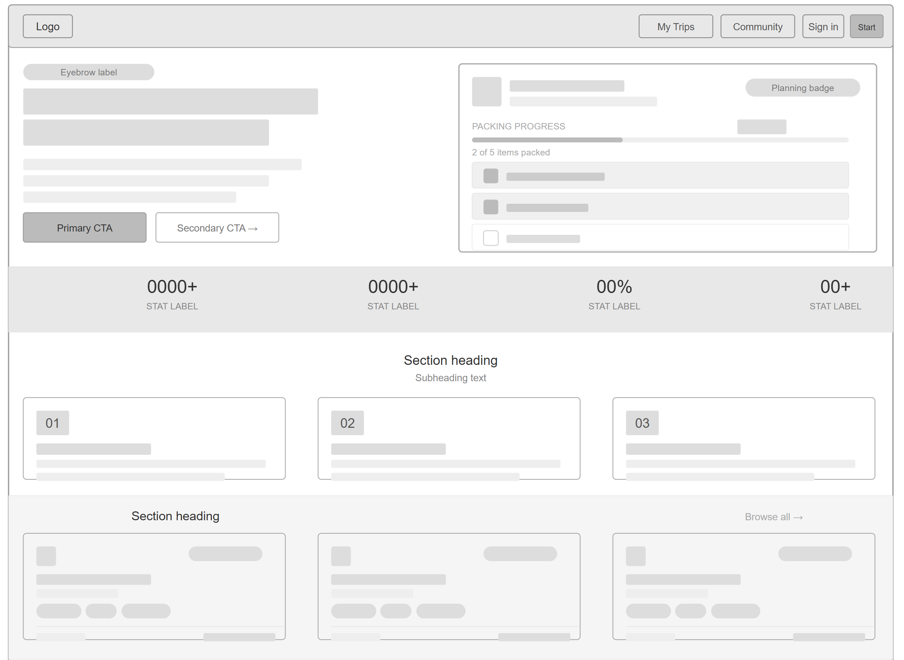
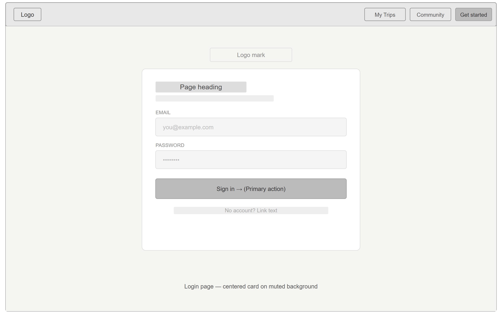
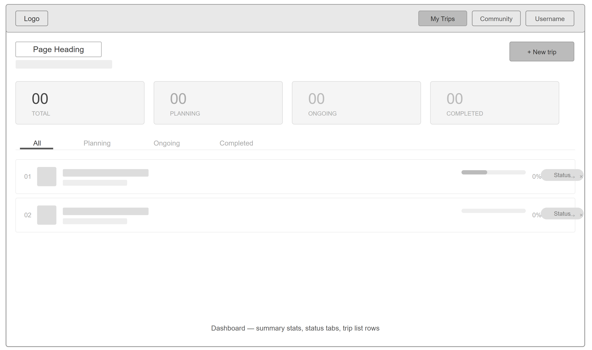
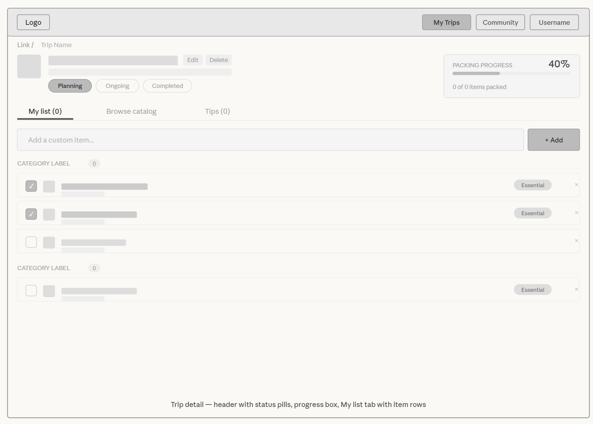
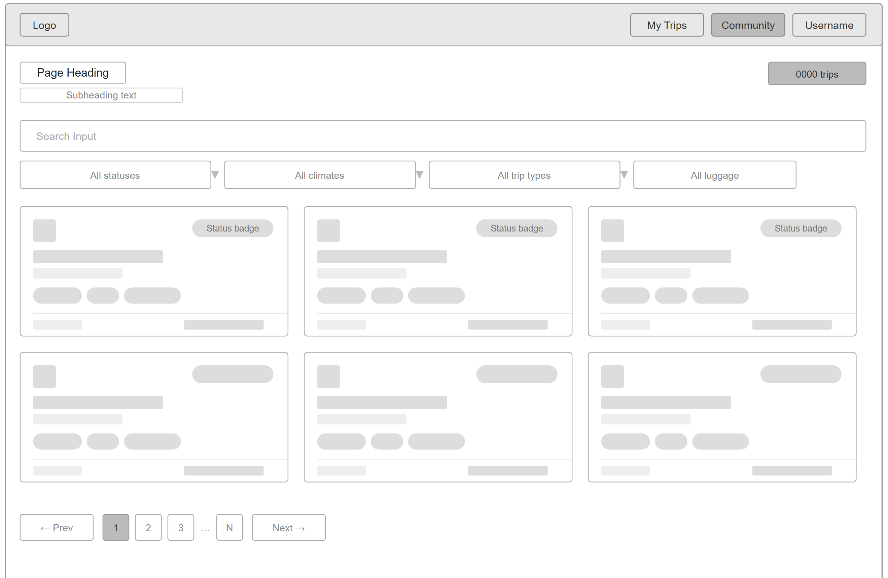
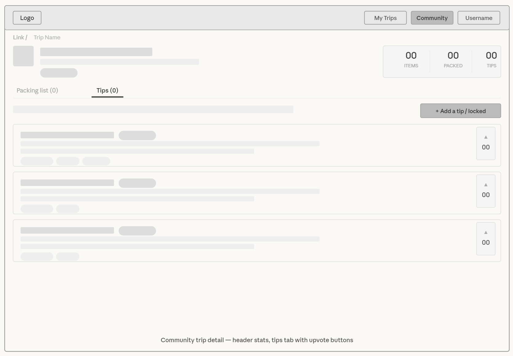
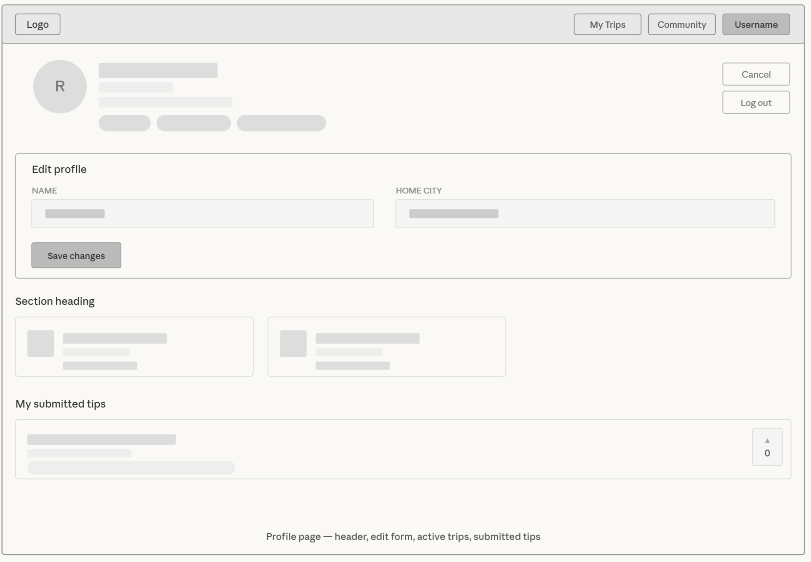

# PackMate - Design Document

## Project Information

- **Project Name:** PackMate - Collaborative Travel Packing List Sharer
- **Team Members:**
  - Rachit Patel (Trips & Packing Items)
  - Prajakta Avachat (Users & Community Tips)
- **Course:** CS 5610 – Web Development
- **Technology Stack:** Node.js, Express, MongoDB, React, Vite

---

## 1. Project Description

### Project Name

**PackMate – Collaborative Travel Packing List Sharer**

### Team Members

- **Rachit Patel** – Implementing Trips & Packing Items collections with full CRUD
- **Prajakta Avachat** – Implementing Users & Community Tips collections with full CRUD

### Short Description

Travelers waste hours researching what to pack, often forgetting essentials or over-packing for the wrong climate — especially students going abroad or taking their first solo trip. PackMate solves this by letting travelers build and manage structured packing lists for their trips while the community contributes and upvotes real-world packing tips per trip type. Users create a trip by entering their destination, climate, trip type, and duration, then build their packing list by selecting from a categorized master items database (Clothing, Electronics, Toiletries, Documents, Activity Gear) and adding custom items of their own. Community members who've traveled to similar destinations can share and upvote packing tips, which appear alongside each trip's list.

### Technical Independence

**Rachit's Work:**

- **Trips collection** – tripName, destination, country, climate, tripType, luggageType, durationDays, startDate, endDate, status, items array (itemId reference + isChecked + isCustom + customName)
- **Items collection** – name, category, climateTags, tripTypeTags, isEssential
- Fully functional for trip CRUD, browsing and filtering the master items catalog by category, adding items to a trip list, item check-off with progress tracking, custom item addition, and community trip browsing — all without requiring the Users system

**Prajakta's Work:**

- **Users collection** – name, email, passwordHash, homeCity
- **CommunityTips collection** – title, description, email, tripTypeTags, climateTags, upvoteCount, upvotedBy array, isVerified, isFeatured
- Full authentication system
- Fully functional for user management, tip submission and browsing, upvote and remove-upvote system, and filtering tips by trip type and climate — all without requiring the Trips system

---

## 2. User Personas

### Persona 1: Sarah

**CS junior studying abroad in Europe who needs a carry-on-only packing list for cold weather and business casual settings**

**Demographics:**

- Age: 21
- Year: Junior
- Major: Computer Science
- Travel Habits: First time studying abroad, semester-long trip

**Goals:**

- Build a compact packing list that fits carry-on only
- Find items appropriate for cold European weather
- See what experienced travelers bring for city and business trips
- Save time by not starting from scratch

**Pain Points:**

- Overwhelmed by the variety of items to consider
- Unsure what essentials to bring for cold climates
- No structured way to track what she's already packed
- Can't find relevant advice for her specific trip type

**How PackMate Helps:**

- Filter catalog by cold climate and city/business trip type
- Check off items as she packs to track progress
- Browse community tips from travelers who've done similar trips
- Custom items for anything not in the catalog

**Typical User Journey:**

1. Creates a trip: Destination – Paris, Climate – Cold, Type – City, Duration – 120 days
2. Browses catalog filtered to cold + city items
3. Adds Thermal Underlayer, Winter Coat, Laptop & Charger
4. Adds custom item "French phrasebook"
5. Reads community tips for cold city trips
6. Checks off items as she packs the night before departure

---

### Persona 2: Marcus

**Freshman taking his first solo beach trip who is overwhelmed by packing and wants to browse what experienced travelers recommend**

**Demographics:**

- Age: 18
- Year: Freshman
- Major: Undeclared
- Travel Habits: First solo trip ever

**Goals:**

- Get a guided packing list for a beach trip
- Learn from experienced travelers
- Avoid forgetting essentials
- Build confidence before his first solo trip

**Pain Points:**

- No idea where to start when building a packing list
- Afraid of over-packing or under-packing
- Doesn't know what's essential vs. optional for beach trips
- No one in his network has done a similar trip recently

**How PackMate Helps:**

- Create a beach trip and see pre-categorized items
- Browse community trips from other beach travelers
- Read and upvote tips specific to tropical beach trips
- Progress bar gives visual feedback on packing completion

**Typical User Journey:**

1. Creates a trip: Destination – Cancun, Climate – Tropical, Type – Beach, Duration – 7 days
2. Adds items from the catalog – Swimsuit, Reef-Safe Sunscreen, First Aid Kit
3. Navigates to community page, browses other beach trips
4. Reads tips on a tropical beach trip and upvotes helpful ones
5. Adds custom item "waterproof phone case"
6. Marks items as packed in the days before departure

---

### Persona 3: Priya

**Graduate student organizing a group hiking trip who needs a structured gear checklist and wants advice from people who've done similar trips**

**Demographics:**

- Age: 24
- Year: Graduate Student
- Major: Environmental Science
- Travel Habits: Regular hiker, first time organizing for a group

**Goals:**

- Build a comprehensive gear checklist for cold-weather hiking
- Ensure nothing critical is left off the list
- Find advice from experienced hikers
- Contribute tips after completing her trip

**Pain Points:**

- Responsible for ensuring the whole group is prepared
- Gear requirements for cold hiking are complex
- Hard to find advice specific to her destination's climate
- No structured place to consolidate her group's packing plan

**How PackMate Helps:**

- Create a hiking trip and get a climate-appropriate catalog
- Browse community trips from other cold-weather hikers
- Read tips from experienced hikers in cold climates
- After the trip, submit her own tips to help future hikers

**Typical User Journey:**

1. Creates a trip: Destination – Zermatt, Climate – Cold, Type – Hiking, Duration – 5 days
2. Adds Hiking Boots, Trekking Poles, First Aid Kit, Thermal Underlayer
3. Browses community hiking trips in cold climates for inspiration
4. Reads tips, upvotes "Sock liners prevent blisters"
5. Returns after trip, marks status as Completed
6. Submits tip: "Always pack an extra base layer even if forecast looks mild"

---

### Persona 4: Alex

**Budget backpacker hopping between multiple countries who needs minimalist lists and proven tips for long multi-destination travel**

**Demographics:**

- Age: 22
- Year: Senior
- Major: International Relations
- Travel Habits: Frequent traveler, multi-country backpacking

**Goals:**

- Build the most minimal packing list possible
- Avoid checking luggage to save money and time
- Find tips from experienced backpackers
- Reuse packing lists across similar trips

**Pain Points:**

- Every extra gram costs him on budget airlines
- Tips from casual tourists don't apply to long-haul backpacking
- No structured way to refine and minimize his lists over time
- Hard to find advice specific to multi-climate backpacking

**How PackMate Helps:**

- Filter catalog by backpacking trip type
- Custom items for ultralight-specific gear
- Browse community backpacking trips for inspiration
- Community tips filtered to backpacking type surface the most relevant advice

**Typical User Journey:**

1. Creates a trip: Destination – Bangkok, Climate – Tropical, Type – Backpacking, Duration – 30 days
2. Adds only essential items: Travel Adapter, Reusable Water Bottle, First Aid Kit, Packing Cubes
3. Adds custom items: "Compression sacks", "Laundry detergent sheets"
4. Browses community page, filters by backpacking type
5. Reads tips, upvotes "Roll, don't fold your clothes"
6. Submits tip after returning: "Bring only two pairs of shoes maximum"

---

## 3. User Stories

### Rachit's Implementation (Trips & Packing Items)

**US-1: Create and Manage a Trip**

> _As a traveler, I want to create a trip by entering destination, climate, trip type, and duration, so I have a dedicated space to build my packing list._

**Acceptance Criteria:**

- User can create a trip with: tripName, destination, country, climate, tripType, luggageType, durationDays, startDate, endDate
- Trip is saved to the database and appears on the dashboard immediately
- User can edit trip details after creation
- User can delete a trip from the dashboard or trip detail page
- Dashboard shows all trips with status badges (planning, ongoing, completed)
- Trips can be filtered by status on the dashboard

---

**US-2: Build a Packing List from the Catalog**

> _As a traveler, I want to browse master packing items by category (Clothing, Electronics, Documents), so I can pick relevant items and add them to my trip list._

**Acceptance Criteria:**

- Catalog tab shows all items from the database
- Items can be filtered by category (Clothing, Footwear, Electronics, Toiletries, Documents, Health & Safety, Activity Gear)
- Clicking "Add" on a catalog item adds it to the trip's items array
- Items already added to the trip show as already added in the catalog view
- Items can be removed from the list from both the list tab and catalog tab

---

**US-3: Add Custom Items and Track Packing Progress**

> _As a traveler, I want to add custom items not in the master list and check off items as I pack them, so I can track my progress with a completion percentage._

**Acceptance Criteria:**

- Text input on the list tab allows adding a custom item by name
- Custom items appear under a "Custom" category group
- Each item has a checkbox to mark it as packed
- Progress bar shows checked/total count and percentage
- Checked items appear with strikethrough and reduced opacity
- Progress persists — checking an item updates the database

---

**US-4: Browse Community Trips**

> _As a traveler, I want to browse trips created by the community, filter them by type and climate, and view their packing lists, so I can get inspiration for my own trip._

**Acceptance Criteria:**

- Community page shows all trips in a card grid
- Filters available: status, climate, trip type, luggage type
- Search bar filters by trip name or destination
- Pagination shows 12 trips per page
- Clicking a trip opens a public detail page with read-only packing list grouped by category
- Public detail page shows packed/total count per item

---

### Prajakta's Implementation (Users & Community Tips)

**US-5: Create Account and Login Securely**

> _As a traveler, I want to create an account and log in securely so my trip data and profile are protected._

**Acceptance Criteria:**

- User can register with name, email, and password
- Email must be unique in the system
- Password is securely hashed before storage
- User can log in with valid email and password
- JWT token is generated and stored upon successful login
- Invalid credentials display clear error messages
- Session persists across page refreshes
- Logout clears the token and redirects to home

---

**US-6: Submit and Browse Community Tips**

> _As a traveler, I want to submit a packing tip tagged to a specific trip type and climate, and browse tips from others, so I can share knowledge and find relevant advice._

**Acceptance Criteria:**

- Tip form requires title, description, tripTypeTags, and climateTags
- Tips are only submittable by users who have completed a trip of the same type or climate
- Tips appear on the community trip detail page filtered by that trip's type and climate
- Tips are also browsable via the Community page
- Tips can be sorted by most upvoted or most recent

---

**US-7: Upvote and Remove Upvote on Tips**

> _As a traveler, I want to upvote tips I found genuinely useful and remove upvotes I placed accidentally, so vote counts stay accurate and the best tips rise to the top._

**Acceptance Criteria:**

- Upvote button on each tip card increments the count by 1
- User can only upvote a tip once (guarded on both frontend and backend)
- Upvote state persists across sessions — already upvoted tips show highlighted on reload
- Remove upvote decrements the count by 1
- Optimistic updates apply immediately; reverted on API failure

---

**US-8: View Submitted Tips on Profile**

> _As a traveler, I want to view all tips I've submitted in one place on my profile, so I can track my community contributions._

**Acceptance Criteria:**

- Profile page shows a "My submitted tips" section
- Only tips matching the logged-in user's email are shown
- Tips display upvote count received
- Total upvotes received shown as a summary stat in the profile header
- Empty state shown if no tips submitted yet

---

## 4. Design Mockups

### 4.1 Home Page

**Layout Description:**

- **Hero Section**: Two-column layout — left side has eyebrow label, headline, subtext, and two CTA buttons (Start packing free, Browse community trips). Right side shows a mock trip card with packing progress.
- **Stats Bar**: Full-width muted background strip with four stats (Trips created, Community tips, Said it saved time, Trip categories)
- **How It Works**: Three-column card grid showing steps 01, 02, 03 with color-coded numbers
- **Community Trips**: Card grid showing 6 recent community trips pulled from the database
- **Built For**: Four persona cards with emoji, name, role, and description
- **CTA Section**: Centered text and button — "Ready to pack smarter?"

### 4.1 Login Page

**Layout Description:**

- **Navigation Bar**: Fixed header with logo on the left and Sign in / Get started buttons on the right for unauthenticated users
- **Background**: Full-width muted off-white page background
- **Logo Mark**: Centered PackMate logo mark above the card
- **Card**: Centered white card with rounded corners containing all form elements
- **Heading**: "Welcome back" as the card title with a subtext line below
- **Form Fields**: EMAIL label above a full-width text input with placeholder; PASSWORD label above a full-width password input with masked characters
- **Primary Button**: Full-width dark solid button labeled "Sign in →"

---

### 4.2 My Trips Page

**Layout Description:**

- **Header**: Page title "My Trips" with welcome message and "+ New trip" button on the right
- **Summary Cards**: Four stat cards (Total, Planning, Ongoing, Completed) with color-coded numbers
- **Tab Bar**: Four tabs (All, Planning, Ongoing, Completed) with count badges
- **Trip List**: Vertical list of TripCard components, each showing trip name, destination, status badge, and packing progress

---

### 4.3 Trip Detail Page

**Layout Description:**

- **Breadcrumb**: My Trips › Trip Name
- **Header**: Climate emoji icon, trip name with Edit/Delete buttons, meta info line, status pills (Planning / Ongoing / Completed), progress bar on the right
- **Tab Bar**: My list, Browse catalog, Tips
- **List Tab**: Custom item input at top, items grouped by category with check circles
- **Catalog Tab**: Filter bar by category, grid of PackingItem cards with Add/Remove/Check actions
- **Tips Tab**: Intro text, Add a tip button (if eligible), tip cards with upvote buttons

---

### 4.4 Community Page

**Layout Description:**

- **Page Header**: "Community" title, subtitle, total badge
- **Search Bar**: Full-width input for trip name or destination
- **Filter Row**: Four dropdowns — Status, Climate, Trip Type, Luggage; Clear filters button
- **Trip Grid**: 3-column responsive grid of trip cards, each with climate emoji, status badge, trip name, destination, tags (trip type, duration, luggage), and packed/items footer
- **Pagination**: Prev / page numbers / Next

---

### 4.5 Community Tip Detail Page

**Layout Description:**

- **Breadcrumb**: Community › Trip Name
- **Header**: Climate emoji, trip name, meta line, status badge. Stats box on right showing Items / Packed / Tips counts
- **Tab Bar**: Packing list, Tips
- **Packing List Tab**: Read-only items grouped by category. Each item shows a colored dot (blue if packed), item name, and Packed/Custom badges
- **Tips Tab**: Intro text, eligibility-gated Add tip button or locked message, tip form (if eligible), list of TipCard components with upvote buttons

---

### 4.6 Profile Page

**Layout Description:**

- **Header**: Avatar (first letter of name), name, home city, email, stats pills (trips, tips shared, upvotes received), Edit and Log out buttons
- **Edit Form**: Collapsible card with name and home city fields
- **Currently Packing For**: Horizontal flex row of active/planning trip cards
- **My Submitted Tips**: Vertical list of TipCard components for tips submitted by the logged-in user

---

## 5. Color Scheme & Design System

### Brand Colors

- **Primary Blue:** `var(--blue)` / `#2563EB` — Buttons, links, active states, progress
- **Amber:** `var(--amber)` / `#F59E0B` — Ongoing status, warnings
- **Green:** `var(--green)` / `#22C55E` — Completed status, success
- **Red:** `var(--red-text)` / `#DC2626` — Destructive actions, errors
- **Ink:** `var(--ink)` / `#0F172A` — Primary text
- **Ink-2:** `var(--ink-2)` / `#334155` — Secondary text
- **Ink-3:** `var(--ink-3)` / `#64748B` — Muted text, labels

### Status Color Coding

- 🔵 **Planning:** Blue background `#eff6ff`, blue text `#2563eb`
- 🟡 **Ongoing:** Amber background `#fffbeb`, amber text `#d97706`
- 🟢 **Completed:** Green background `#f0fdf4`, green text `#16a34a`

### Typography

- **Display / Headings:** `var(--font-display)` — Inter, sans-serif (600–700 weight)
- **Body:** `var(--font-body)` — Inter, sans-serif (400–500 weight, 13–15px)
- **Labels / Badges:** Inter, 10–12px, uppercase, letter-spacing 0.05em

### Spacing

- **Card Padding:** 18–24px
- **Card Gap:** 16px
- **Section Padding:** 72px top/bottom
- **Button Padding:** 8–11px vertical, 16–24px horizontal

### Components

- **Cards:** Border radius via `var(--radius-lg)` (12px), `0.5px solid var(--border)` border, white background
- **Buttons:** Solid (dark ink or blue), ghost (border only), pill (99px radius for status/tags)
- **Inputs:** `var(--radius-md)`, focus state with blue border and `var(--blue-bg)` box shadow
- **Badges/Pills:** 99px border radius, small uppercase text, color-coded by context

---

## 6. Technical Architecture Overview

### Frontend Stack

- **React** – Component-based UI
- **React Router** – Client-side routing
- **CSS Modules** – Scoped, component-level styling
- **Vite** – Build tool and dev server
- **Sonner** – Toast notifications

### Backend Stack

- **Node.js** – Runtime environment
- **Express.js** – Web framework
- **MongoDB (Native Driver)** – Database (no Mongoose)
- **Passport.js + JWT** – Authentication
- **bcrypt** – Password hashing

### API Structure

- RESTful endpoints under `/api/`
- JSON responses
- JWT Bearer token authentication via Authorization header
- Error handling returns `{ error: message }` with appropriate HTTP status codes

### Database Collections

1. **users** – User accounts, authentication, profile
2. **trips** – Trip records with embedded items array
3. **items** – Master packing items catalog
4. **communityTips** – Community-submitted tips with upvote tracking

---

## 7. Success Metrics

### User Engagement

- Number of trips created per user
- Average packing list completion percentage
- Community tips submitted per user
- Upvotes cast per session

### System Performance

- API response times under 300ms for standard queries
- Pagination keeping page loads under 500ms for 12-item grids
- Seed scripts completing 1500 trip records without timeout

### User Satisfaction

- Time saved researching packing vs. building from catalog
- Percentage of users who submit at least one tip after completing a trip
- Return user rate (users who create more than one trip)

---

## 8. Future Enhancements (Post-MVP)

### Phase 2 Features

- Trip sharing via public link with read-only access
- Collaborative packing lists for group trips
- Packing list templates per trip type (e.g. "Standard beach kit")
- Push notifications for trip start date reminders

### Phase 3 Features

- Gear weight tracking and carry-on weight calculator
- AI-powered packing suggestions based on destination and dates
- Integration with weather APIs to auto-suggest climate
- Mobile app (iOS/Android) with offline packing list access

### Phase 4 Features

- Social features — follow other travelers, see their public trips
- Verified traveler badge for high-upvote tip contributors
- Admin panel for moderating tips and managing the item catalog
- Analytics dashboard showing most popular items per trip type

---

## 9. Team Responsibilities

### Rachit Patel

**Backend:**

- Trips collection and full CRUD operations
- Items collection and catalog seeding
- Trip packing list management (add/remove/check items, custom items)
- Trip status tracking and filtering
- Community trips browsing API with filters, search, and pagination
- Public trip detail endpoint

**Frontend:**

- Dashboard page with status tabs and trip cards
- Trip detail page (list, catalog, tips tabs)
- Community page with filter/search/pagination
- Community trip detail page (read-only packing list + tips)
- Home page trips section

### Prajakta Avachat

**Backend:**

- Users collection and full CRUD
- CommunityTips collection and full CRUD
- JWT authentication system (register, login, logout)
- Upvote and remove-upvote endpoints with duplicate prevention
- Tips seeding with full climate and trip type coverage

**Frontend:**

- Login and registration pages
- Profile page with submitted tips and active trips
- Tip submission form and upvote interactions
- Navbar with authentication state

### Shared Responsibilities

- Code reviews
- Testing and debugging
- Documentation and README
- Deployment to Vercel + MongoDB Atlas
- Video demo creation and slides

---
